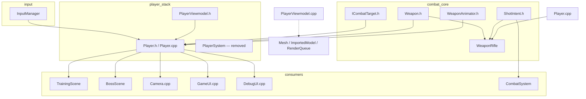
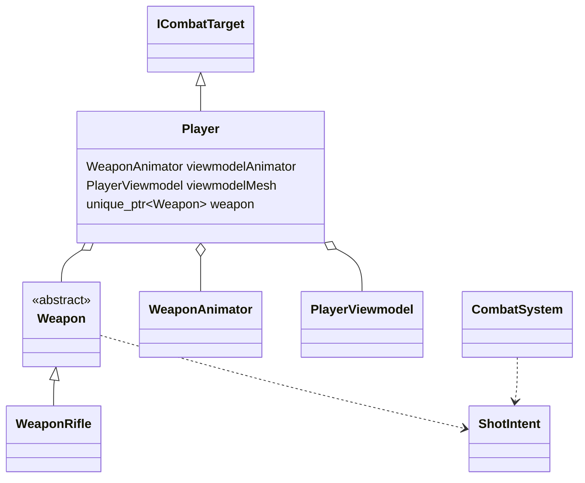
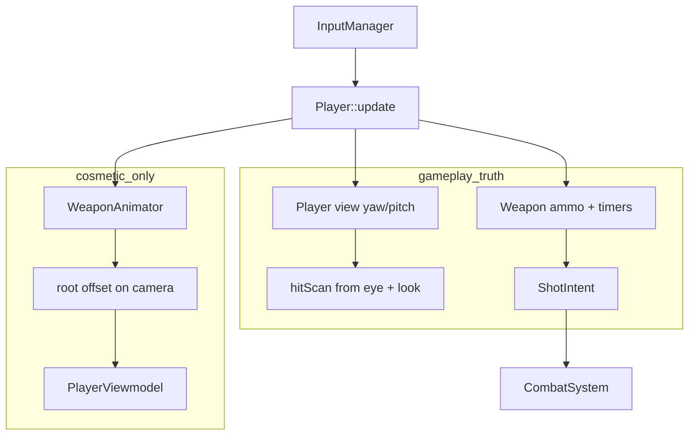
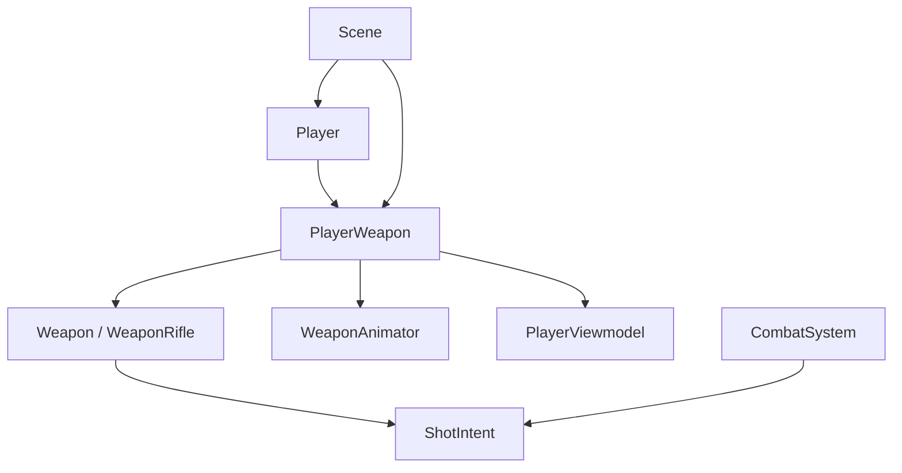

# Player / Weapon / Input / Animation — Readability Report

Audit of the Photonics gameplay slice: **InputManager**, **Player**, **Weapon**, **WeaponAnimator**, **PlayerViewmodel**, and how scenes use them.

**Scope:** discussion and refactor planning — not an implementation checklist.

**Date:** May 2026 (based on current `Source/Gameplay` layout).

---

## Executive summary

| Aspect | Assessment |
|--------|------------|
| Architecture (input → player → weapon → combat) | Reasonable |
| **Names** | Often vague or inconsistent |
| **Duplicate concepts** | Yes — several pairs |
| **File/class boundaries** | Improved (`PlayerViewmodel` split), but labels still conflict |
| **Overall readability** | **Below ideal** for onboarding or long-term maintenance |

The code **works**. The main problem is **vocabulary**: the same words (`weapon`, `viewmodel`, `aim`, `forward`) mean different things in different layers. That creates the feeling of over-engineering and duplication even when structure is mostly fine.

---

## One-frame flow (how pieces connect today)

`PlayerInputState` and `PlayerSystem` have been **removed**. Current path:

```
Scene (Training / Boss)
    │
    ├─ InputManager          ← raw keys/mouse (WASD, LMB, RMB, R, Space)
    │
    └─ Player::update(input, dt, shotIntents)
           │
           ├─ LOOK      applyLookDelta(mouse)        → m_lookYaw / m_lookPitch (gameplay aim)
           ├─ INPUT     aim / fire / reload / move / jump
           ├─ MOVE      applyMovement(...)           → position + body yaw
           ├─ ANIM      updateWeaponAnimation()      → WeaponAnimator (visual only)
           └─ COMBAT    updateWeapon(...)            → Weapon → ShotIntent list
    │
    ├─ CombatSystem          ← resolves ShotIntent (hits, tracers, damage)
    ├─ Camera                ← player look + isAiming (not WeaponAnimator)
    └─ renderWeapon()        ← mesh using animator output
```

### Gameplay vs cosmetic split

| Concern | Owner | Affects hits? |
|---------|--------|----------------|
| Where bullets go | `Player` look (`getLookForward`, `getEyePosition`) | **Yes** |
| Gun mesh motion | `WeaponAnimator` | **No** (by design) |
| Ammo / fire rate / reload | `Weapon` | **Yes** (via `ShotIntent`) |

**Rule of thumb**

- **“Why doesn’t it hit?”** → Player + Weapon + CombatSystem  
- **“Why does the gun look wrong?”** → WeaponAnimator + PlayerViewmodel + `renderWeapon`

---

## File roles

| File | Responsibility |
|------|----------------|
| `InputManager` | OS input only; no game rules |
| `Player` | Input, movement, look, health, weapon + animator orchestration, viewmodel matrix, `ICombatTarget` |
| `Weapon` / `WeaponRifle` | Magazine, fire cooldown, reload, builds `ShotIntent` |
| `WeaponAnimator` | Hip/ADS pose, sway, bob, recoil (composed `position` + `rotationDegrees`) |
| `PlayerViewmodel` | Imported GLB, muzzle node, debug placement settings |
| `ShotIntent` | DTO to `CombatSystem` — **clear boundary** |

There is no separate engine “animation system” — only `WeaponAnimator` on the player.

---

## Include / dependency map (weapon–player slice)



**Hub file:** `Player.h` — many includers → API changes are high-impact.

---

## Type / ownership map



---

## Naming problems (concrete)

### 1. “Weapon” means three different things

| Thing | Symbol | Actual role |
|-------|--------|-------------|
| Gameplay gun | `Weapon`, `m_weapon` | Ammo, fire, reload, `ShotIntent` |
| First-person mesh | `PlayerViewmodel`, `m_viewmodelMesh` | GLB + muzzle node |
| Motion / feel | `WeaponAnimator`, `m_viewmodelAnimator` | Sway, bob, recoil, ADS blend |

Conflicting method names:

| Method | Draws / runs |
|--------|----------------|
| `renderWeapon()` | **Mesh** (not `Weapon` class) |
| `updateWeapon()` | **Combat** `Weapon::update` |
| `updateWeaponAnimation()` | **Animator** |

### 2. “Viewmodel” is overloaded

Used for:

- class `PlayerViewmodel` (static mesh)
- `getViewmodelAnimator()` (motion)
- `createViewmodelRootWorldMatrix`
- scene `renderViewmodel()` → calls `player->renderWeapon()`

Scene says **viewmodel**, player says **renderWeapon**, members say **viewmodelMesh** + **viewmodelAnimator**.

### 3. Two (three) “forward” directions

| API | Source |
|-----|--------|
| `getLookForward()` | `m_lookYaw`, `m_lookPitch` — camera / hitscan |
| `getForward()` | `m_transform.rotation.y` — horizontal only |
| Body yaw | Set each frame: `m_transform.rotation.y = radians(m_lookYaw)` |

`getForward()` is almost redundant with flattened look yaw. **Only `GameUI.cpp` uses `getForward()`.**

### 4. Look vs aim vs ADS

| Name | Meaning |
|------|---------|
| `m_lookYaw`, `getLookYaw` | View / crosshair orientation |
| `m_isAiming`, `isAiming()` | RMB held (input) |
| `WeaponAnimationTuning::adsPosition` | Visual gun pose |
| Camera `player.isAiming()` | Follow camera mode |

Same player action (RMB), different vocabulary in three places.

### 5. Similar function names, different jobs

| Function | Role |
|----------|------|
| `Player::updateWeapon` | Combat loop, `ShotIntent` |
| `Player::updateWeaponAnimation` | Cosmetic motion |
| `Weapon::update` | Combat inside weapon |
| `WeaponAnimator::update` | Cosmetic inside animator |

`updateWeapon` vs `updateWeaponAnimation` reads like duplicate work.

### 6. `applyLookDelta` — confusing return value

Updates look state, returns `Vector2` **only for animator sway**:

- `.x` — raw yaw delta (degrees)
- `.y` — **clamped** pitch delta (not full pitch)

Call site: `weaponLookDeltaDegrees` — sounds weapon-related; it is **view-sway input**.

### 7. Thin wrappers and mismatched terms

On `Player`:

```cpp
int getAmmo() const { return m_weapon->getAmmoCount(); }
int getMaxAmmo() const { return m_weapon->getClipSize(); }
```

Same concepts, different words (`Ammo` vs `AmmoCount`, `MaxAmmo` vs `ClipSize`).

Long passthroughs for rifle debug:

- `hasImportedRifleViewmodel()` → `m_viewmodelMesh.hasImportedRifle()`
- `getImportedRifleViewmodelSettings()` → `m_viewmodelMesh.settings()`

### 8. Class names vs contents

| Name | Suggests | Actually |
|------|----------|----------|
| `WeaponAnimator` | Skeletal clips | Procedural offsets |
| `PlayerViewmodel` | Generic FP model | Imported rifle only |
| `Weapon` | Entire gun | Firing economy + shot payload |
| `ShotIntent` | — | **Clear** (good name) |

---

## Duplication checklist

| Duplicate | Locations |
|-----------|-----------|
| Aim yaw | `m_lookYaw` and `m_transform.rotation.y` (same value written each frame) |
| Horizontal forward | `getLookForward()` (y=0) vs `getForward()` |
| “Update weapon” | `Player::updateWeapon` vs `Weapon::update` |
| Draw FP gun | `Scene::renderViewmodel` vs `Player::renderWeapon` |
| Rifle settings | `Player` forwards vs `PlayerViewmodel::settings()` |
| Reload state | `Player::isReloading()` vs `m_weapon->isReloading()` |
| Move direction | `playerMovementDirection()` in `Player.cpp` anonymous namespace |

Some layering is intentional; without distinct names it reads as accidental copy-paste.

---

## Dead or barely used API

| Symbol | Status |
|--------|--------|
| `Weapon::cancelReload()` | No callers |
| `Weapon::outOfAmmo()` | No callers |
| `Weapon::isFiring()` | No external callers |
| `Weapon::finalize()` | Empty virtual |
| `Player::getForward()` | Only `GameUI.cpp` |
| `PlayerInputState` / `PlayerSystem` | **Removed** (good) |
| Procedural `gun.json` path in `initialize()` | **Removed**; imported rifle only |
| Landing animation (`onLand`) | **Removed** from animator |

`Weapon::canFire()` is used internally — not dead.

---

## What is justified (keep)

| Piece | Why |
|-------|-----|
| `ShotIntent` + `CombatSystem` | Weapon does not need target lists |
| `WeaponAnimator` separate from `Weapon` | Visual recoil must not move crosshair |
| `PlayerViewmodel` separate from `Player` | Asset load vs gameplay |
| `clearInputState()` | Debug (F3) exit — unstuck fire/aim |
| `EventBus::WeaponShotEvent` | Scene SFX on shot |
| `Player::update(InputManager&)` | Simpler than old `PlayerSystem` layer |

---

## Over-engineering vs appropriate

**Appropriate for a small FPS**

- Input → single `Player::update`
- Weapon emits intents; combat resolves
- Animator affects viewmodel matrix only

**Feels over-engineered**

- Abstract `Weapon` with one subclass (`WeaponRifle`)
- Large `WeaponAnimationTuning` + feature flags before gameplay is frozen
- `applyLookDelta` return value only for sway
- Duplicate facing storage (`m_lookYaw` + `m_transform.rotation.y`)
- Grand matrix helper names (e.g. `createGameplayCameraWorldMatrix` for muzzle)

**No longer over-engineered**

- Removing `PlayerSystem` / `PlayerInputState`

---

## Suggested vocabulary (target glossary)

Use consistently in renames and new code:

| Concept | Suggested name |
|---------|----------------|
| Crosshair / camera direction | `viewYaw`, `viewPitch`, `getViewForward()` |
| RMB held | `isAdsActive` |
| Combat gun logic | `Weapon` or `Firearm` |
| FP mesh | `FirstPersonGunModel` / keep `PlayerViewmodel` with clear comment |
| Sway / bob / recoil | `FirstPersonGunMotion` / rename `WeaponAnimator` |
| Draw FP gun | `drawFirstPersonGun()` (not `renderWeapon`) |
| Shot payload | **`ShotIntent`** (keep) |

**Rule:** Do not use bare **“weapon”** for mesh-only or motion-only code.

---

## Proposed renames (examples)

| Current | Clearer alternative |
|---------|---------------------|
| `updateWeapon` | `updateFirearm` / `tickCombatGun` |
| `updateWeaponAnimation` | `updateFirstPersonMotion` / `tickHeldGunMotion` |
| `renderWeapon` | `drawFirstPersonGun` / `drawViewmodel` |
| `getViewmodelAnimator()` | `getFirstPersonMotion()` (if class renamed) |
| `m_viewmodelMesh` | `m_firstPersonGunModel` |
| `m_viewmodelAnimator` | `m_firstPersonGunMotion` |
| `getForward()` | Remove or `getFlatViewForward()` |
| `isAiming()` | `isAdsActive()` |
| `applyLookDelta` | `addViewDelta` + separate sway deltas |
| `weaponLookDeltaDegrees` | `swayInputDegrees` |

---

## Recommended cleanup order

1. Rename worst collisions (`updateWeapon` / `updateWeaponAnimation`, `renderWeapon`, viewmodel vs mesh).
2. Remove dead `Weapon` API; resolve `getForward` vs `getLookForward`.
3. Store yaw once (drop redundant `m_transform.rotation.y` if always equal to look yaw, or document why both exist).
4. Stop long `Player` forwards for rifle debug — scenes use `getViewmodelMesh()` or a small debug facade.
5. Collapse to one weapon class until a second gun exists.

---

## Quick reference — who owns what?

| Question | Answer |
|----------|--------|
| Who reads keyboard? | `Player::update` |
| Who owns mouse sensitivity? | `Player` (`m_mouseSensitivity`) |
| Who owns ADS? | `Player` sets `m_isAiming`; `WeaponAnimator` blends hip → ADS pose |
| Who fires (logic)? | `Weapon::update` when `m_firing && canFire()` |
| Who moves the gun mesh? | `WeaponAnimator` output × `PlayerViewmodel` |
| Does recoil change aim? | **No** — hitscan uses `getLookForward()` from eyes |

---

## Mental model diagram



---

## Maps useful for refactor (reference)

When cleaning, maintain three living views:

1. **Include graph** — when splitting headers  
2. **Data-flow** — when moving fire / reload / viewmodel  
3. **Fan-in list** — files that `#include "Gameplay/Player.h"`

| Map type | Best for |
|----------|----------|
| Include / file graph | Compile coupling, header slimming |
| Type / class graph | Extracting classes |
| Layer graph | Gameplay → Render → UI boundaries |
| Data-flow graph | `ShotIntent`, events |
| Call graph / find-all-references | Dead API removal |

For this slice, **include + data-flow + fan-in** are enough; full call-graph tooling is optional.

---

## Related files (audit scope)

```
Source/Gameplay/Player.h
Source/Gameplay/Player.cpp
Source/Gameplay/PlayerViewmodel.h
Source/Gameplay/PlayerViewmodel.cpp
Source/Gameplay/Combat/Weapon.h
Source/Gameplay/Combat/Weapon.cpp
Source/Gameplay/Combat/WeaponRifle.h
Source/Gameplay/Combat/WeaponRifle.cpp
Source/Gameplay/Combat/WeaponAnimator.h
Source/Gameplay/Combat/WeaponAnimator.cpp
Source/Gameplay/Combat/ShotIntent.h
Source/Services/InputManager.h
Source/Scenes/TrainingScene.cpp
Source/Scenes/BossScene.cpp
Source/Common/Camera.cpp
Source/UI/GameUI.cpp
Source/UI/DebugUI.cpp
```

---

## Target architecture (proposed)

> **Visual guide (functions, sequences, diagrams):** [PlayerWeaponTargetArchitecture.md](./PlayerWeaponTargetArchitecture.md)

This section records the agreed direction for a readability refactor. **Not yet implemented** unless the codebase matches it.

### Ownership

```
Player
  owns PlayerWeapon
    owns Weapon-derived combat weapon   (currently WeaponRifle)
    owns WeaponAnimator
    owns PlayerViewmodel
```

### Recommended file roles

| File | Role |
|------|------|
| `Source/Gameplay/Player.h/.cpp` | Player body: input reading, movement, view yaw/pitch, jump, health, collision, combat target state. **No** rifle, viewmodel, muzzle, or animator internals. |
| `Source/Gameplay/PlayerWeapon.h/.cpp` | Player’s equipped weapon assembly. Owns combat weapon, first-person model, weapon motion, muzzle calculation, render submission, fire/reload coordination. |
| `Source/Gameplay/Combat/Weapon.h/.cpp` | Abstract/base combat weapon. Ammo, reload timer, fire cooldown, firing state, `update()`, `reload()`, `startFire()`, `stopFire()`. |
| `Source/Gameplay/Combat/WeaponRifle.h/.cpp` | Rifle-specific stats and `shoot()` that emits `ShotIntent`. |
| `Source/Gameplay/Combat/WeaponAnimator.h/.cpp` | Cosmetic first-person motion only: ADS blend, sway, bob, recoil. **Does not** affect hitscan direction. |
| `Source/Gameplay/PlayerViewmodel.h/.cpp` | Imported first-person weapon model: load GLB, placement settings, model matrix, muzzle node lookup, submit render command. |
| `Source/Gameplay/Combat/ShotIntent.h` | Shot request DTO consumed by `CombatSystem`. **Keep as-is.** |

### `Weapon.h` — reusable combat base

`Weapon.h` stays the base for future weapons (`WeaponShotgun`, `WeaponLauncher`, `WeaponBeam`, etc.):

```cpp
class Weapon
{
public:
    virtual ~Weapon() = default;
    virtual void initialize();

    bool update(
        float deltaTime,
        const Vector3& hitScanOrigin,
        const Vector3& hitScanDirection,
        const Vector3& tracerStart,
        std::vector<ShotIntent>& outIntents);

    void startFire();
    void stopFire();
    void reload();

    bool isReloading() const;
    int getAmmoCount() const;
    int getClipSize() const;

protected:
    virtual bool shoot(
        const Vector3& hitScanOrigin,
        const Vector3& hitScanDirection,
        const Vector3& tracerStart,
        std::vector<ShotIntent>& outIntents) = 0;
};
```

Drop unused API from the audit (`cancelReload`, `outOfAmmo`, empty `finalize`) unless a weapon needs them.

### `PlayerWeapon` — coordinates the held weapon

Small facade allowed to coordinate combat + mesh + motion:

```cpp
class PlayerWeapon
{
public:
    explicit PlayerWeapon(SceneContext& context);

    void initialize();
    void finalize();
    void reset();
    void clearInputState();

    void update(const PlayerWeaponFrame& frame, std::vector<ShotIntent>& outIntents);
    void drawFirstPerson(RenderCommandQueue& queue, const Matrix& view) const;

    bool isReloading() const;
    int getAmmo() const;
    int getMaxAmmo() const;

    WeaponAnimationTuning* getAnimationTuning();
    bool hasRifleViewmodel() const;
    ImportedRifleViewmodelSettings& getRifleViewmodelSettings();
    void resetRifleViewmodelSettings();
};
```

**Naming:** rename `renderWeapon()` → `drawFirstPerson()` or `drawFirstPersonWeapon()`. The old name sounds like it renders the `Weapon` class; it actually draws the first-person model.

`Player` exposes: `PlayerWeapon& getWeapon();` (or `getEquippedWeapon()`).

### `PlayerWeaponFrame` — per-frame snapshot from `Player`

Define one struct so `PlayerWeapon::update` does not take `InputManager` and does not reach into `Player` private state:

```cpp
struct PlayerWeaponFrame
{
    float deltaTime = 0.0f;

    // Gameplay aim (hitscan)
    Vector3 hitScanOrigin;
    Vector3 hitScanDirection;

    // Cosmetic sway input (degrees); not the same as full look state
    Vector2 viewDeltaDegrees;

    // Input-derived
    bool fireHeld = false;
    bool adsHeld = false;
    bool reloadPressed = false;

    // Movement context for bob
    float moveSpeed01 = 0.0f;
    bool isGrounded = true;

    // For muzzle / draw (camera view matrix from scene)
    Matrix viewMatrix;
};
```

`Player` builds this after updating view/movement, then calls `m_weapon.update(frame, outIntents)`.

### Player call flow (after cleanup)

**Update:**

```
Scene
  -> Player::update(input, dt, shotIntents)
      -> Player reads raw input
      -> Player updates view / movement / jump / health timers
      -> Player builds PlayerWeaponFrame
      -> PlayerWeapon::update(frame, shotIntents)
          -> apply fire / reload from frame to Weapon
          -> WeaponAnimator::update(...)
          -> compute muzzle from view + animator + PlayerViewmodel
          -> Weapon::update(...)
              -> WeaponRifle::shoot(...)
                  -> emits ShotIntent
          -> if shot fired: WeaponAnimator::onWeaponFired()
```

**Render:**

```
Scene
  -> player.getWeapon().drawFirstPerson(queue, view)
      -> PlayerWeapon reads animator pose
      -> PlayerViewmodel submits imported rifle
```

### What stays on `Player` only

| Concern | Owner |
|---------|--------|
| `ICombatTarget`, health, invincibility | `Player` |
| `getLookYaw` / `getLookPitch` / `getLookForward` | `Player` |
| `InputManager` reading | `Player` |
| `isAiming()` for **camera** | `Player` can mirror `frame.adsHeld` or expose `isAdsActive()` |
| Equipped weapon facade | `PlayerWeapon` |

### Scene / UI migration

| Before | After |
|--------|--------|
| `m_player->renderWeapon(...)` | `m_player->getWeapon().drawFirstPerson(...)` |
| `m_player->getViewmodelAnimator()` | `m_player->getWeapon().getAnimationTuning()` |
| `m_player->getImportedRifleViewmodelSettings()` | `m_player->getWeapon().getRifleViewmodelSettings()` |
| `m_player->getAmmo()` | `m_player->getWeapon().getAmmo()` (or keep thin wrappers on `Player` for UI only) |

### Target dependency graph



`Player.h` should **not** include `WeaponAnimator.h` or `PlayerViewmodel.h` — only `PlayerWeapon.h` (or forward declare `PlayerWeapon`).

### Design notes / open choices

1. **UI accessors:** Either `GameUI` uses `player.getWeapon().getAmmo()`, or `Player` keeps one-line forwards for HUD only — pick one style, not both long-term.
2. **Weapon type:** `PlayerWeapon` constructs `WeaponRifle` today; later: factory, loadout, or `std::unique_ptr<Weapon>` set at spawn.
3. **Hitscan vs tracer:** `hitScanOrigin` / `hitScanDirection` from player eyes + view; `tracerStart` from muzzle inside `PlayerWeapon` — keep that split explicit in `PlayerWeaponFrame` comments.
4. **Implementation order:** introduce `PlayerWeapon` + `PlayerWeaponFrame` with move-only refactor (no behavior change), then rename `drawFirstPerson`, then slim `Player.h` includes.

---

*Generated for refactor planning. Update this document when major renames or structural changes land.*
