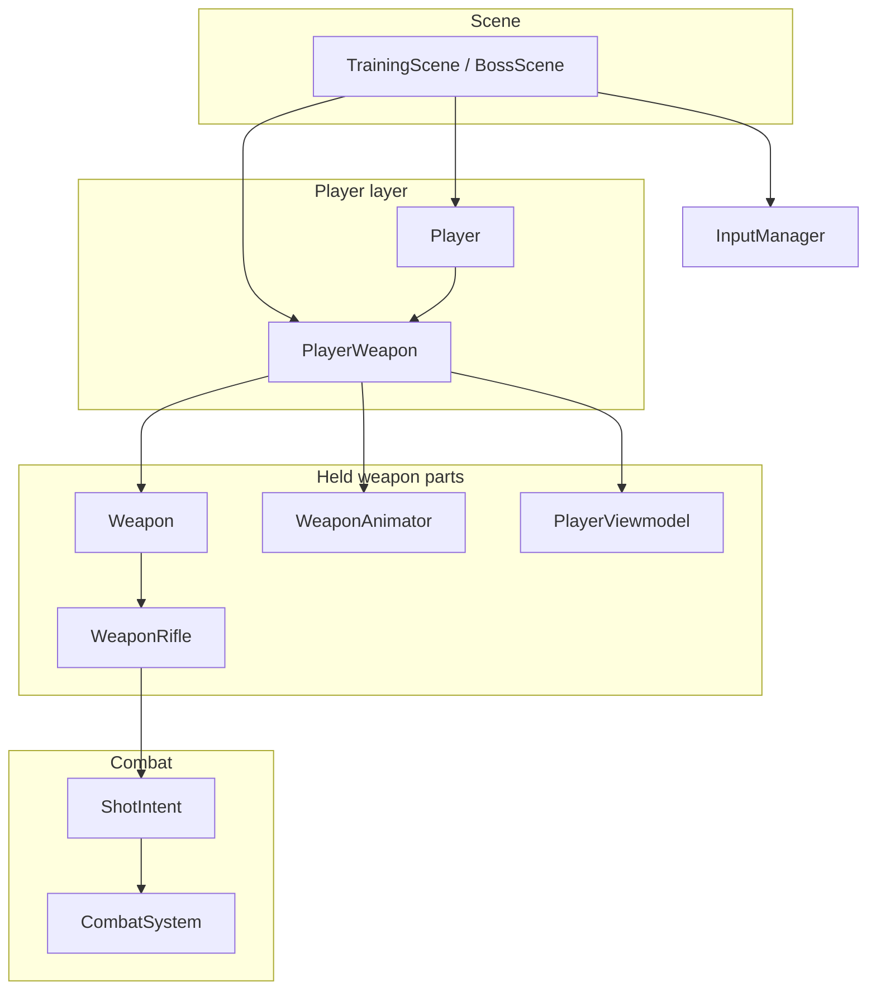
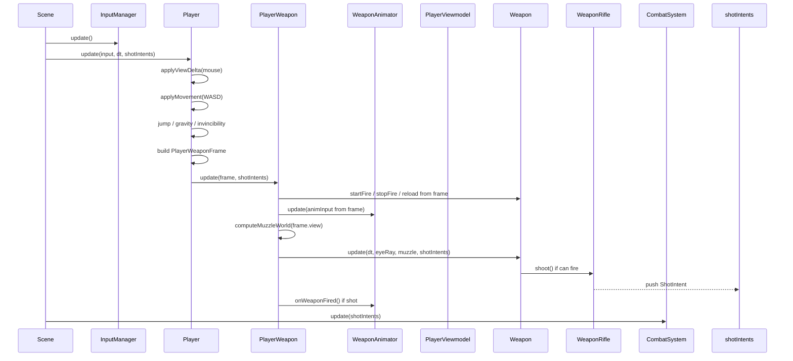
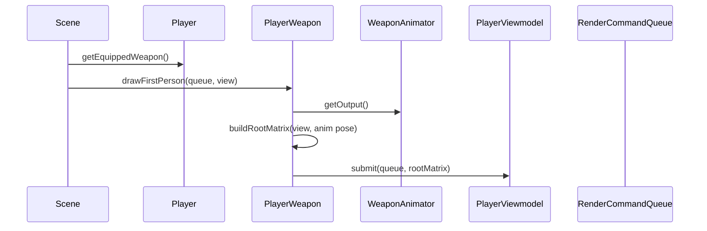

# After cleanup — visual architecture & function map

**Status:** target design (not necessarily implemented yet).  
**Companion:** [PlayerWeaponReadabilityReport.md](./PlayerWeaponReadabilityReport.md)

This document answers: *“What files exist, who owns whom, and what does every function do?”*

---

## 1. Big picture (boxes)

```
┌─────────────────────────────────────────────────────────────────────────┐
│  Scene (TrainingScene / BossScene)                                      │
│    • calls Player::update(input)                                        │
│    • calls player.getEquippedWeapon().drawFirstPerson(view)             │
│    • passes shotIntents → CombatSystem                                  │
└───────────────────────────────┬─────────────────────────────────────────┘
                                │
                                ▼
┌─────────────────────────────────────────────────────────────────────────┐
│  Player  —  “the human in the world”                                    │
│    view yaw/pitch, move, jump, health, damage, ICombatTarget            │
│    reads InputManager                                                   │
│    owns ──────────────────────────────────────────────┐                 │
└────────────────────────────────────────────────────────│─────────────────┘
                                                         │
                                                         ▼
┌─────────────────────────────────────────────────────────────────────────┐
│  PlayerWeapon  —  “what is in the player’s hands”                      │
│    coordinates combat + first-person look + draw                        │
│    owns ───────────┬────────────────────┬──────────────────────────     │
└────────────────────│────────────────────│────────────────────────────────┘
                     │                    │
         ┌───────────▼──────────┐  ┌──────▼─────────────┐  ┌──────────────▼────────────┐
         │  Weapon (abstract)   │  │  WeaponAnimator    │  │  PlayerViewmodel          │
         │  WeaponRifle today   │  │  sway/bob/recoil   │  │  imported GLB mesh        │
         │  ammo, fire, reload  │  │  ADS pose blend    │  │  muzzle node, draw        │
         └───────────┬──────────┘  └────────────────────┘  └───────────────────────────┘
                     │
                     ▼
              ┌──────────────┐
              │  ShotIntent  │  ──►  CombatSystem
              └──────────────┘
```

**One sentence per layer**

| Layer | One job |
|-------|---------|
| **InputManager** | Raw keys / mouse delta from OS |
| **Player** | Body in the world + camera look + read input |
| **PlayerWeapon** | Everything about the held gun (logic + look + draw) |
| **Weapon** | Can I shoot? build `ShotIntent` |
| **WeaponAnimator** | Make the gun mesh feel alive (not aim) |
| **PlayerViewmodel** | Load & draw the 3D rifle file |

---

## 2. Ownership tree



---

## 3. Update frame — sequence (who calls whom)



---

## 4. Render frame — sequence



---

## 5. Shared struct: `PlayerWeaponFrame`

Built by **Player**, consumed by **PlayerWeapon** (one snapshot per frame).

| Field | Set by Player from… | Used for |
|-------|---------------------|----------|
| `deltaTime` | scene | timers, animator, weapon |
| `hitScanOrigin` | `getEyePosition()` | **where bullets are tested** |
| `hitScanDirection` | `getLookForward()` | **bullet direction** |
| `viewDeltaDegrees` | mouse × sensitivity (sway input) | animator sway only |
| `fireHeld` | LMB | `Weapon::startFire/stopFire` |
| `adsHeld` | RMB | animator ADS + `Player::isAiming` |
| `reloadPressed` | R key | `Weapon::reload` |
| `moveSpeed01` | position delta / max speed | walk bob |
| `isGrounded` | jump/gravity | walk bob |
| `viewMatrix` | scene camera view | muzzle + draw matrix |

---

## 6. Every class — public functions & roles

### InputManager (`Source/Services/InputManager.h`)

*Unchanged — not owned by Player/Weapon refactor.*

| Function | Role |
|----------|------|
| `initialize(window)` | Hook keyboard/mouse |
| `update()` | Poll devices each frame |
| `isKeyDown / isKeyPressed / isKeyReleased` | WASD, R, Space, etc. |
| `getMouseDelta()` | Look input |
| `isLeftMouseDown` / `isRightMouseDown` | Fire / ADS |
| `setCursorVisible` | Menu vs gameplay |

---

### Player (`Source/Gameplay/Player.h/.cpp`)

**Theme:** character in the level — **no** muzzle math, **no** mesh load, **no** `WeaponAnimator` in public API.

| Function | Who calls it | Role |
|----------|--------------|------|
| `Player(context)` | Scene | Store `SceneContext`, create `PlayerWeapon` |
| `initialize()` | Scene | Init body + `m_equippedWeapon.initialize()` |
| `finalize()` | Scene | Teardown |
| `reset()` | Scene | Spawn defaults, reset health & weapon |
| **`update(input, dt, shotIntents)`** | Scene | **Main tick:** input → body → build frame → weapon |
| `clearInputState()` | Scene (debug F3) | Release fire/ADS stuck state on weapon |
| `getEquippedWeapon()` | Scene, DebugUI | Access held-weapon facade |
| **View / aim (gameplay truth)** | | |
| `getLookYaw()` / `getLookPitch()` | Camera | Third-person / aim camera |
| `getLookForward()` / `getLookRight()` | Internal, frame build | Hitscan direction |
| `getEyePosition()` | Frame build | Ray origin |
| **Body** | | |
| `getPosition()` / `setPosition()` | Camera, Boss, UI | World position |
| `getPositionPtr()` | Boss targeting | Stable pointer for AI |
| `getTransformPtr()` | DebugUI | Editor-style nudge |
| `isGrounded()` | (optional UI) | Jump state |
| `isAiming()` | Camera, GameUI | RMB ADS flag (mirror of frame) |
| **Health / combat target** | | |
| `takeDamage(amount)` | Combat | Apply HP, start invincibility |
| `getHealth()` / `getMaxHealth()` / `setHealth()` | UI | HUD |
| `isDead()` / `isInvincible()` | Combat, logic | Gate hits |
| `collectHitColliders(out)` | Combat | Player body sphere |
| `onHit(hit)` | Combat | Damage + events |
| **Settings** | | |
| `getMouseSensitivity()` / `Ptr()` | DebugUI | Tune look |
| **Optional HUD forwards** (pick one style) | | |
| `getAmmo()` / `getMaxAmmo()` / `isReloading()` | GameUI | Thin delegate → `getEquippedWeapon()` |

**Player private (after cleanup)**

| Function | Role |
|----------|------|
| `applyViewDelta(yaw, pitch)` | Update `m_lookYaw` / `m_lookPitch`, return sway deltas |
| `applyMovement(dir, yaw, dt)` | Move + clamp arena + set body yaw |
| `jump()` | If grounded, apply jump velocity |
| `updateVerticalMovement(dt)` | Gravity + land |
| `updateInvincibility(dt)` | Damage iframe timer |
| `calculateMoveSpeed01(dt)` | 0..1 speed for weapon frame |
| `buildWeaponFrame(input, dt, view)` | Fill `PlayerWeaponFrame` |

**Removed from Player (moves to PlayerWeapon)**

| Old on Player | New home |
|---------------|----------|
| `renderWeapon` | `PlayerWeapon::drawFirstPerson` |
| `updateWeapon` | `PlayerWeapon::update` (inside) |
| `updateWeaponAnimation` | `PlayerWeapon::update` (inside) |
| `getMuzzlePosition` | `PlayerWeapon` private |
| `createViewmodelRootWorldMatrix` | `PlayerWeapon` private |
| `createGameplayCameraWorldMatrix` | `PlayerWeapon` private (or shared util) |
| `setFiring` / `reload` | `PlayerWeapon` from frame |
| `getViewmodelAnimator()` | `getEquippedWeapon().getAnimationTuning()` |
| Rifle settings forwards | `getEquippedWeapon().getRifleViewmodelSettings()` |
| `getForward()` | Delete or `getFlatLookForward()` on Player if UI needs it |

---

### PlayerWeapon (`Source/Gameplay/PlayerWeapon.h/.cpp`) — **new**

**Theme:** single entry for “gun in hands.”

| Function | Who calls it | Role |
|----------|--------------|------|
| `PlayerWeapon(context)` | Player ctor | Create `WeaponRifle`, animator, viewmodel |
| `initialize()` | Player | Load GLB, `Weapon::initialize()` |
| `finalize()` | Player | Release mesh |
| `reset()` | Player | Reset ammo, animator, mesh settings |
| `clearInputState()` | Player | `stopFire`, clear ADS-driven state |
| **`update(frame, shotIntents)`** | Player | **Orchestrate** fire input, anim, muzzle, combat |
| **`drawFirstPerson(queue, view)`** | Scene | Build pose matrix, `PlayerViewmodel::submit` |
| `isReloading()` | UI (via Player or direct) | HUD |
| `getAmmo()` / `getMaxAmmo()` | UI | HUD |
| `getAnimationTuning()` | DebugUI | Sway/bob/recoil sliders |
| `hasRifleViewmodel()` | TrainingScene debug | GLB loaded? |
| `getRifleViewmodelSettings()` | TrainingScene debug | Placement tuning |
| `resetRifleViewmodelSettings()` | TrainingScene debug | Defaults |

**PlayerWeapon private (expected)**

| Function | Role |
|----------|------|
| `applyInputToCombat(frame)` | `startFire`/`stopFire`/`reload` on `Weapon` |
| `buildAnimInput(frame)` | Map frame → `WeaponAnimationInput` |
| `computeMuzzleWorld(frame)` | View × anim root × model × muzzle local |
| `buildFirstPersonRootMatrix(view)` | Camera world × animator output |
| `onShotFired()` | `WeaponAnimator::onWeaponFired()` |

**Members**

```
unique_ptr<Weapon>     m_combat;      // WeaponRifle today
WeaponAnimator         m_motion;
PlayerViewmodel        m_model;
```

---

### Weapon (`Source/Gameplay/Combat/Weapon.h/.cpp`)

**Theme:** combat economy + timing — **no** rendering, **no** input.

| Function | Who calls it | Role |
|----------|--------------|------|
| `initialize()` | PlayerWeapon | Full mag, reset timers |
| **`update(dt, origin, dir, tracer, out)`** | PlayerWeapon | Tick cooldown/reload; if firing → `shoot()` |
| `startFire()` / `stopFire()` | PlayerWeapon | Hold-to-fire flag |
| `reload()` | PlayerWeapon | Start reload if mag not full |
| `isReloading()` | UI | HUD |
| `getAmmoCount()` / `getClipSize()` | UI | HUD |
| `canFire()` | internal | Cooldown + ammo + not reloading |
| **`shoot(...)`** *(protected, virtual)* | `Weapon::update` | Weapon-specific `ShotIntent` |

**Removed in cleanup (if unused)**

| Function | Note |
|----------|------|
| `cancelReload()` | No callers |
| `outOfAmmo()` | No callers |
| `isFiring()` | Internal only |
| `finalize()` | Empty |

---

### WeaponRifle (`Source/Gameplay/Combat/WeaponRifle.h/.cpp`)

| Function | Role |
|----------|------|
| `initialize()` | Set rifle stats (30 round, 0.08s fire, damage 12, …) then `Weapon::initialize()` |
| `shoot(...)` | Push one `ShotIntent` with rifle damage/range/color |

*Future:* `WeaponShotgun`, `WeaponLauncher` — same pattern, only `shoot()` + `initialize()` differ.

---

### WeaponAnimator (`Source/Gameplay/Combat/WeaponAnimator.h/.cpp`)

**Theme:** cosmetic offset in camera space — **does not** change `hitScanDirection`.

| Function | Who calls it | Role |
|----------|--------------|------|
| **`update(input)`** | PlayerWeapon | Compose base pose + sway + bob + recoil |
| `onWeaponFired()` | PlayerWeapon | Kick recoil back/pitch |
| `reset()` | PlayerWeapon | Zero state on respawn |
| `getOutput()` | PlayerWeapon draw | Final position + rotationDegrees |
| `getTuningPtr()` | DebugUI | Live tweak |

**Private layers**

| Function | Role |
|----------|------|
| `updateAds(dt, aiming)` | Blend hip ↔ ADS |
| `computeBasePose()` | Lerp hip/ADS position & rotation |
| `computeSway(lookDelta, dt)` | Weapon lags behind camera turn |
| `computeBob(speed01, grounded, dt)` | Walk cycle |
| `computeRecoil(dt)` | Recover toward zero after kick |

---

### PlayerViewmodel (`Source/Gameplay/PlayerViewmodel.h/.cpp`)

**Theme:** asset + draw — **no** gameplay.

| Function | Who calls it | Role |
|----------|--------------|------|
| `loadImportedRifle(context, path)` | PlayerWeapon::initialize | Cache GLB, bounds |
| `submit(queue, rootWorld)` | PlayerWeapon::drawFirstPerson | Enqueue draw command |
| `buildModelWorldMatrix(rootWorld)` | Muzzle / draw | Scale/rotate rifle mesh under root |
| `getMuzzleLocalPosition()` | PlayerWeapon | `VM_Muzzle` node or fallback Z |
| `finalize()` | PlayerWeapon | Clear pointers |
| `hasImportedRifle()` | Debug UI | |
| `settings()` / `resetSettings()` | Debug UI | Placement tuning |

---

### ShotIntent (`Source/Gameplay/Combat/ShotIntent.h`)

**Unchanged** — data only.

| Field | Role |
|-------|------|
| `hitScanOrigin` / `hitScanDirection` | Raycast |
| `tracerStart` | Visual line from muzzle |
| `damage` / `maxRange` | Combat rules |
| `tracerColor` / `faction` | FX + friendly fire |

---

## 7. External callers — what they use after cleanup

| Caller | Calls | Purpose |
|--------|-------|---------|
| **TrainingScene / BossScene** | `player->update(input, dt, intents)` | Gameplay tick |
| | `player->getEquippedWeapon().drawFirstPerson(queue, view)` | FP gun draw |
| | `player->clearInputState()` | Debug mode exit |
| | `combatSystem.update(..., intents)` | Resolve shots |
| **Camera** | `getLookYaw/Pitch`, `isAiming`, `getPosition` | Chase cam |
| **GameUI** | `getHealth`, `getAmmo`, `isReloading`, `isAiming` | HUD |
| **DebugUI** | `getEquippedWeapon().getAnimationTuning()` | Motion sliders |
| | `getRifleViewmodelSettings()` | Rifle debug |
| **Boss** | `getPositionPtr()` | Target player |

---

## 8. File folder mental map

```
Source/
  Services/
    InputManager.*          ← OS input

  Gameplay/
    Player.*                ← body + look + input orchestration
    PlayerWeapon.*          ← NEW: held weapon coordinator
    PlayerViewmodel.*       ← GLB mesh only

    Combat/
      Weapon.*              ← abstract combat
      WeaponRifle.*         ← one implementation
      WeaponAnimator.*      ← cosmetic motion
      ShotIntent.h          ← DTO
      ICombatTarget.h       ← damage interface (Player implements)

    Systems/
      CombatSystem.*        ← consumes ShotIntent

  Scenes/
    TrainingScene.*         ← wires input → player → combat → draw
    BossScene.*
```

---

## 9. Current vs target (quick diff)

| Topic | **Now** | **After cleanup** |
|-------|---------|-------------------|
| Entry tick | `Player::update` does body + gun + anim + combat | `Player::update` does body; delegates gun to `PlayerWeapon` |
| Draw | `Player::renderWeapon` | `PlayerWeapon::drawFirstPerson` |
| Includes in `Player.h` | Weapon, Animator, Viewmodel | `PlayerWeapon` only |
| Debug anim sliders | `getViewmodelAnimator()` | `getEquippedWeapon().getAnimationTuning()` |
| Muzzle | `Player::getMuzzlePosition` | inside `PlayerWeapon` |
| Add new gun type | change `Player` ctor | change `PlayerWeapon` ctor / factory only |

---

## 10. “Where do I put new code?” cheat sheet

| I want to… | Put it in… |
|------------|------------|
| Change walk speed, jump, HP | **Player** |
| Change damage, fire rate, mag size | **WeaponRifle** or new **Weapon** subclass |
| Change gun sway / bob / recoil feel | **WeaponAnimator** tuning |
| Change rifle model path / mesh offset | **PlayerViewmodel** |
| Change tracer color / pellet logic | **Weapon::shoot** in subclass |
| Wire LMB / R / R key | **Player::update** → frame → **PlayerWeapon** |
| Change crosshair / minimap | **GameUI** (reads Player) |
| Hit detection rules | **CombatSystem** (reads **ShotIntent**) |

---

*Open this file side-by-side with the codebase when implementing the refactor.*
